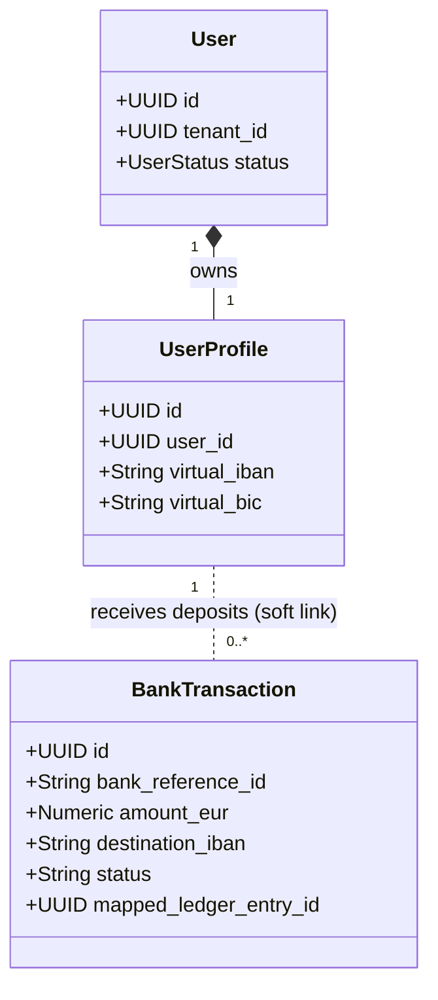

# Design Specification: Institutional Euro Deposits via Virtual IBANs (vIBANs)

This document details the architectural design, API integration options, regulatory considerations, and database schema mappings for handling Euro (EUR) client deposits via Dedicated Virtual IBANs, tailored to a deposit range of **€10,000 (Min) to €100,000 (Max)** and leveraging the company's existing corporate account at **Bank of Ireland (BOI)**.

---

## 1. Why Virtual IBANs (vIBANs) are Mandatory for Titan

For HNWIs and corporate clients depositing between **€10,000 and €100,000**, credit cards and retail payment processors are inappropriate due to transaction limits and high fees. 

### 1.1 Clearing Rail Optimization: The Power of SEPA Instant
Because the platform’s maximum deposit is capped at **€100,000**:
* **100% Instant Clearing Coverage**: The European regulatory limit for a single **SEPA Instant Credit Transfer** is exactly **€100,000**.
* **Real-time UX**: Every client deposit on the platform can settle in under 10 seconds, 24/7/365, matching the speed of retail card payments while costing pennies per transaction.

---

## 2. Integrating with Bank of Ireland (BOI)

Having a corporate bank account with Bank of Ireland (BOI) opens up two distinct integration pathways for issuing virtual IBANs and securing client deposits.

```
OPTION A: Direct Bank of Ireland VAM (Virtual Account Management)
[ Client Portal ] ──► [ Dedicated BOI vIBAN ] ──► [ BOI Master Corporate Account ]
                                                          │
                                                          ▼ (Batch ISO 20022 MT940 / CAMT.053 Statement)
                                                    [ Titan Ledger ] (Delayed Reconcile)

OPTION B: API Provider (e.g. Modulr) with Auto-Sweep to Bank of Ireland
[ Client Portal ] ──► [ Dedicated Modulr vIBAN ] ──► [ Regulated Safeguarding Account ]
                                                              │
                                                              ▼ (Instant Webhook)
                                                        [ Titan Ledger ] (Instant Reconcile)
                                                              │
                                                              ▼ (End-of-day Sweep)
                                                    [ BOI Master Corporate Account ]
```

### 2.1 Option A: Direct Bank of Ireland VAM (Virtual Account Management)
Bank of Ireland offers Virtual Account Management (VAM) for corporate treasury customers.
* **How it works**: BOI allocates a range of IBANs under your main corporate account.
* **Integration**: Notifications of incoming payments are received via host-to-host SFTP or corporate API endpoints using **ISO 20022 XML** files (e.g., `CAMT.053` end-of-day statements or `CAMT.054` real-time credit notifications).
* **Tradeoffs**:
  * **Pros**: Direct relationship with BOI; lower third-party risk; no intermediate platforms.
  * **Cons**: Direct corporate banking APIs from legacy banks are slow to integrate, require heavy compliance audits, and typically provide batch updates (e.g. end of day) rather than instant REST webhooks.

### 2.2 Option B: API Provider (Modulr) with Auto-Sweep to BOI (Recommended)
This hybrid approach leverages a modern API for user-facing features while keeping final funds in Bank of Ireland.
* **How it works**: Modulr manages the virtual IBAN generation and receives the instant SEPA webhooks to update the client's balance in real-time.
* **The Sweep**: The platform automatically triggers a daily sweep (or threshold-based transfer) to move settled funds from Modulr's safeguarded account to your main **Bank of Ireland corporate account**.
* **Tradeoffs**:
  * **Pros**: Modern REST API, instant webhooks (<10 seconds balance updates), fast go-to-market.
  * **Cons**: Involves a third-party Electronic Money Institution (EMI).

---

## 3. Core & Payments Database Schema Mappings

The database schema divides authentication and profile details (`core`) from financial transaction records (`payments`) to maintain security and GDPR decoupling.



### 3.1 Profile Extension (`core.user_profiles`)
Add columns to store the allocated virtual bank details once the client completes onboarding:
```sql
ALTER TABLE core.user_profiles 
ADD COLUMN virtual_iban TEXT UNIQUE,
ADD COLUMN virtual_bic TEXT;
```

### 3.2 Bank Transactions Table (`payments.bank_transactions`)
When Modulr or BOI fires the payment notification, the payments system logs the receipt:
```sql
CREATE TABLE payments.bank_transactions (
    id UUID PRIMARY KEY DEFAULT gen_random_uuid(),
    bank_reference_id TEXT UNIQUE NOT NULL, -- Provider transaction ID or BOI End-to-End ID
    amount_eur NUMERIC(18,4) NOT NULL CHECK (amount_eur >= 10000.00 AND amount_eur <= 100000.00), -- Enforce €10k - €100k limits
    remitter_name TEXT NOT NULL,
    remitter_iban TEXT NOT NULL,
    destination_iban TEXT NOT NULL, -- Used to map to core.user_profiles.virtual_iban
    status payments.bank_transaction_status NOT NULL DEFAULT 'PENDING',
    mapped_ledger_entry_id UUID, -- Soft link to core.ledger_entries
    created_at TIMESTAMPTZ NOT NULL DEFAULT NOW()
);
```

---

## 4. Operational Webhook Lifecycle Flow (Option B)

1. **Client Setup**:
   * Client signs agreement -> Status transitions to `PENDING_INVESTMENT`.
   * The backend fires a call to Modulr: `POST /v1/accounts` requesting an `IE` IBAN.
   * Modulr returns `IE12MODU30012498765432` and `MODUIE2D`.
   * We write these values to `core.user_profiles.virtual_iban` and `virtual_bic`.
2. **Dashboard Display**:
   * The client is presented with their dedicated Irish deposit bank account details.
3. **Inbound Wire**:
   * Client initiates a €100,000 SEPA Instant Transfer.
   * Modulr settles the wire and sends a POST webhook to `https://api.titan.com/payments/webhooks/modulr`:
     ```json
     {
       "event": "PAYMENT_RECEIVED",
       "data": {
         "id": "tx_abc123xyz",
         "amount": 100000.00,
         "destinationAccount": "IE12MODU30012498765432",
         "remitterName": "Acme Capital Ltd",
         "remitterIban": "IE98AIBK93002498765432"
       }
     }
     ```
4. **Reconciliation Transaction (Outbox Pattern)**:
   * **Verification**: Verify webhook signature using the shared webhook secret.
   * **Identity Lookup**: Find the `user_id` where `virtual_iban = destinationAccount`.
   * **Insert Log**: Save record in `payments.bank_transactions`.
   * **Book Ledger**: Create a database transaction that:
     1. Inserts credit entry into `core.ledger_entries` (increasing user balance).
     2. Updates `payments.bank_transactions.status = 'SETTLED'`.
     3. Updates the `core.users.status` to `ACTIVE`.
5. **Sweeping Funds to BOI**:
   * At 17:00 UTC daily, a scheduled task sweeps the accumulated balances from Modulr to the corporate **Bank of Ireland** account:
     ```bash
     # Logic handles transfer from Modulr pool account to BOI IBAN
     POST /v1/payments
     Body: { source: ModulrPool, destination: BOI_Corporate_IBAN, amount: total_settled_balance }
     ```
