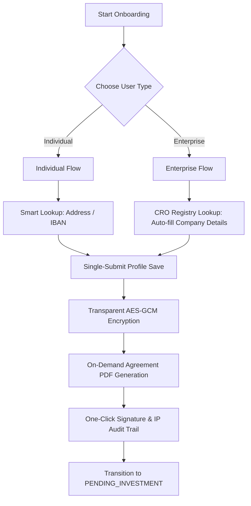

# Design Specification: High-Hospitality Onboarding API (Individual vs. Enterprise)

This document outlines the API design and user experience strategies required to onboard High-Net-Worth Individuals (HNWIs) and busy Corporate Enterprise representatives on the Titan platform without friction.

---

## 1. The UX Challenge: Low Friction vs. Strict Compliance

Irish and EU private funds operate under strict Anti-Money Laundering (AML) and Know Your Customer/Business (KYC/KYB) regulations. Traditionally, this requires extensive questionnaires that lead to high drop-off rates.

### Segment Analysis

| Dimension | Individual Clients (HNWIs) | Enterprise Clients (Corporates) |
|---|---|---|
| **Representative** | The direct investor (e.g., busy executive, doctor, founder) | Corporate secretary, assistant, or executive director |
| **Typical Value** | €100k - €1M | €500k - €10M+ |
| **Time Tolerance** | Very Low (wants to complete in <3 minutes) | Low, but accepts that corporate checks require documents |
| **Documents Needed** | ID, Proof of Address, Tax TIN | Incorporation Cert, UBO register, Board Resolution, Director IDs |
| **UX Danger** | Typing long addresses, entering IBANs manually | Session timeouts, losing progress, unable to upload big PDFs |

---

## 2. Recommended API Design Architecture

To ensure a seamless, professional experience, the onboarding API should utilize **polymorphism, progressive state preservation, and data enrichment**.



### 2.1 Polymorphic Profile Payload (`POST /api/profiles/me`)
Rather than maintaining separate endpoints for individuals and companies, utilize a single endpoint that accepts a polymorphic schema verified by class-validator decorators.

```typescript
// SaveProfileDto
export class SaveProfileDto {
  @IsEnum(UserType)
  type!: UserType;

  @IsNotEmpty()
  fullName!: string; // Individual: Legal Name | Enterprise: Company Name

  @ValidateIf(o => o.type === UserType.ENTERPRISE)
  @IsNotEmpty()
  contactPerson!: string; // Primary contact representative

  @ValidateIf(o => o.type === UserType.ENTERPRISE)
  @IsNotEmpty()
  companyRegistrationNumber?: string; // CRO Registration Number

  @IsNotEmpty()
  phone!: string;

  @IsNotEmpty()
  address!: string;

  @IsNotEmpty()
  bankAccountNumber!: string; // IBAN

  @IsObject()
  bankRoutingInfo!: BankRoutingInfoDto;
}
```

### 2.2 Onboarding Drafts API (Save-As-You-Go)
Enterprise users often need to collect documents or information (like company BIC or Tax ID) and return later. 
* **The Problem**: Our `core.user_profiles` table has strict `NOT_NULL` constraints, preventing partial records from being saved.
* **The Solution**: Expose a temporary **Draft Storage API** (`POST /api/profiles/draft` and `GET /api/profiles/draft`) that stores partially completed profiles in a single `JSONB` column inside the `users` table or a separate lightweight table.
* **Flow**:
  1. As the user typing is detected (debounce 500ms), the frontend sends the draft to `POST /api/profiles/draft`.
  2. If the user closes their tab, they resume exactly where they left off.
  3. Once the user clicks "Submit", the frontend calls `POST /api/profiles/me` with the completed data, validating it, and deletes the temporary draft.

### 2.3 Smart Autocomplete & Data Enrichment
To wow the client and eliminate typing:
* **Enterprise Registry Integration**:
  * **API Endpoint**: `GET /api/enrichment/company?registrationNumber=XXXX`
  * **Implementation**: Integrates with the Irish Companies Registration Office (CRO) or OpenCorporates API.
  * **UX**: The client types their Registration Number, and the API instantly auto-fills the Company Name, Registered Address, and Directors.
* **Bank Routing Validation**:
  * **API Endpoint**: `GET /api/enrichment/bank?iban=IE12BOFI...`
  * **UX**: When the user enters their IBAN, the API automatically resolves the BIC (SWIFT code) and Bank Name (e.g. Bank of Ireland), prepopulating `bankRoutingInfo`.

### 2.4 Delegated Signing (Enterprise Specific)
Often, the person filling out the company profile (e.g., an accountant or assistant) is not the Authorized Director who is legally allowed to sign the investment agreement.
* **API Flow**:
  1. Representative completes profile: `POST /api/profiles/me`. User status transitions to `PENDING_AGREEMENT`.
  2. Representative requests a signature link: `POST /api/profiles/generate-signature-link`.
  3. The system generates a secure, tokenized URL (valid for 7 days) and sends it to the Signing Director.
  4. The Director opens the link, reviews the pre-filled profile, scrolls the agreement, and signs: `POST /api/profiles/sign-agreement` (bypassing full system log-in checks).

---

## 3. Current Implementation Status & Next Steps

Our V1 API implements the core foundations:
* **Decrypted Profile Reads**: `GET /api/profiles/me` handles transparent application decryption.
* **Secure Profile Writes**: `POST /api/profiles/me` encrypts PII atomically to satisfy database constraints.
* **Audit Trails & Outbox**: `POST /api/profiles/sign-agreement` logs the legal signature footprint and queues downstream confirmation emails.

### V2 Roadmap Recommendations for High-Value Onboarding:
1. **Draft Saving Endpoint**: Implement `POST /api/profiles/draft` using a `JSONB` metadata field on `User`.
2. **Eircode / CRO Integration**: Add address/company lookup services to pre-populate form fields.
3. **Delegated Signing Tokens**: Implement tokenized signature endpoints for corporate directors.
